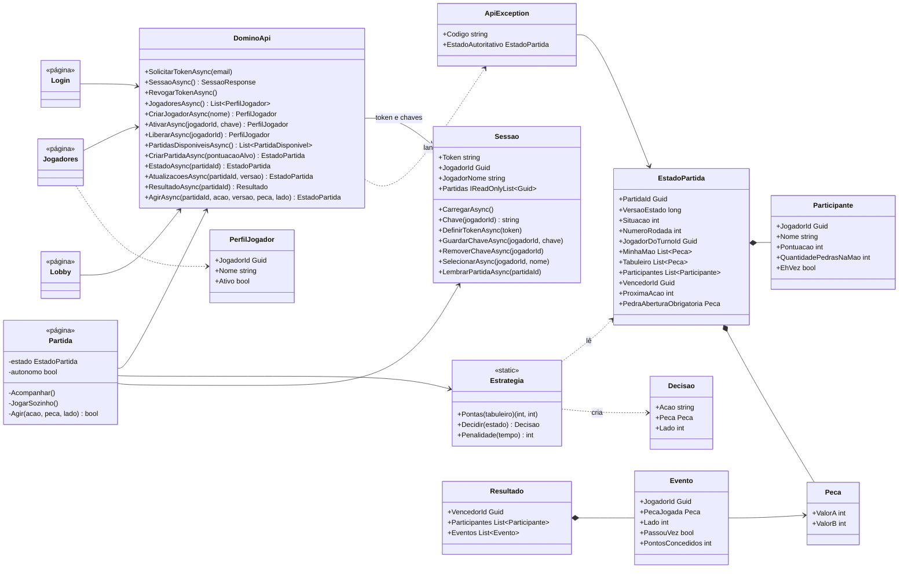

# Dominó Ponta de Quina — CP6 C#

**Integrantes**
- Ricardo Fernandes de Aquino — RM554597
- Khadija do Rocio Vieira de Lima — RM558971

Jogo de navegador em **Blazor Web App (.NET 8, Interactive Server)** que consome a API
[Dominó Ponta de Quina](https://domino-quina-atbkg6ckcwbpd5gz.westus3-01.azurewebsites.net/swagger).

Os componentes rodam no servidor, então as chamadas HTTP saem do servidor ASP.NET (a API não habilita CORS
para chamadas feitas direto do navegador).

**🎮 Jogar online:** https://domino-ponta-de-quina.onrender.com

## Como rodar
```bash
cd DominoQuina
dotnet run
```
Abra a URL exibida no terminal (ex.: http://localhost:5xxx).

## Deploy (Render, gratuito)
O repositório tem `render.yaml` + `DominoQuina/Dockerfile`. No Render: **New → Blueprint**, escolha este repositório e confirme.
(Plano free dorme após ~15 min sem acesso; o primeiro acesso depois disso demora ~1 min.)

## Como jogar
1. **Conta**: informe seu e-mail FIAP para receber o token e cole o token recebido.
2. **Jogadores**: crie um jogador e clique em **Ativar** (o app gera a chave de ativação de 64 hex e guarda no navegador). Depois clique em **Jogar com este**.
3. **Lobby**: crie uma partida (pontuação alvo) ou entre numa partida aguardando adversário.
4. **Partida**: com 2 participantes, clique em **Iniciar**. Na sua vez, selecione uma pedra e jogue na ponta esquerda ou direita, ou use **Comprar**/**Passar**. A tela se atualiza sozinha (polling em `/atualizacoes`). No final aparecem o vencedor e o histórico.

Na partida, o topo mostra rodada, **versão do estado**, **próxima ação** e, na sua vez, o **relógio** com a prévia do
desconto por demora (regra futura do enunciado: até 10 s → 0, até 30 s → 1, menos de 60 s → 2, 60 s ou mais → 3; a API ainda não aplica).

## Jogador autônomo
Marque **🤖 Jogador autônomo** na tela da partida. A cada atualização (1,5 s), sempre a partir do estado confirmado pela API, ele:
1. inicia a partida quando a mesa tem 2 participantes;
2. na sua vez, joga a pedra de abertura obrigatória, se houver;
3. senão, escolhe o encaixe que deixa a soma das pontas múltipla de 5 com mais pontos (empate: a pedra mais pesada);
4. sem encaixe, compra; se a API recusar a compra (sem cava), passa.

Se a API recusar um lance, ele não tenta o mesmo lance de novo na mesma versão: compra (ou passa). A lógica fica em
`Estrategia.cs` e é coberta pelos testes. Para ver uma partida inteira sem intervenção, abra duas abas com jogadores diferentes e ligue o bot nas duas.

## Testes
```bash
dotnet test DominoQuina.Tests
```
O projeto xUnit `DominoQuina.Tests/` cobre:
- `Estrategia`: orientação das pontas, abertura obrigatória, preferência por lance que pontua, compra e tabela de penalidade;
- `ApiException`: tradução dos códigos de erro;
- `DominoApi` (com `HttpMessageHandler` falso): cabeçalhos Bearer e `X-Jogador-Ativacao`, corpo da jogada, 204 → sem mudança,
  rejeição com `estadoAutoritativo` e 401 limpando o token e voltando para o login.

Para testar sozinho: crie 2 jogadores e abra 2 abas, cada uma com um jogador diferente
(o jogador selecionado fica no `sessionStorage` da aba; token e chaves ficam no `localStorage`).

## Estrutura
| Arquivo | Papel |
|---|---|
| `DominoApi.cs` | Cliente HTTP tipado: um método por endpoint, Bearer + `X-Jogador-Ativacao`, erros viram `ApiException` |
| `Models.cs` | DTOs do swagger |
| `Sessao.cs` | Token, chaves de ativação e jogador selecionado (Protected Browser Storage) |
| `ApiException.cs` | Códigos de erro da API traduzidos em mensagens |
| `Estrategia.cs` | Jogador autônomo (escolha do lance) e prévia da penalidade por demora |
| `Components/Pages/*` | Telas: Conta (`Login`), Jogadores, Lobby, Partida |
| `Components/Placa.razor` | Placa de um jogador no topo da partida (nome, pedras na mão, pontos, vez) |
| `wwwroot/mesa.js` | Mesa em canvas: tabuleiro, mão, cava e arrastar pedras até a ponta |
| `../DominoQuina.Tests/` | Testes automatizados (xUnit) |

Erros da API: 401 apaga o token e volta para a tela de conta; 409 aplica o `estadoAutoritativo`; 403/422/429 aparecem como
aviso e a tela continua mostrando só o estado confirmado (a jogada recusada volta para a mão). Estados com versão menor que
a atual são ignorados.

## Diagrama de classes

